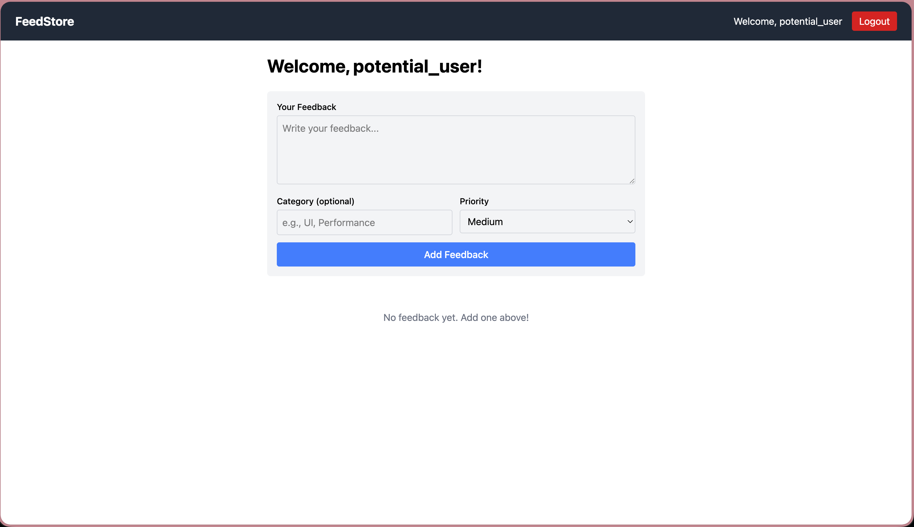

# Introducing FBReflect

<p align="center">
  
</p>

**v1.0.0** – A lightweight feedback platform for organizing and managing feedback, helping you remember what you need.

Ideal for personal growth, team dynamics, and organizational structure.

---

## 🚀 Demo (To Be Determined)

---

## ✨ Features

<ul>
<li>📝 Add, edit, and remove feedback entries</li>
<li>🎨 Intuitive UI with icons and buttons for fast interaction</li>
<li>📂 Create, update, and delete tabs and subtabs (planned)</li> 
<li>🧠 AI Priority Mapper (planned)</li>
<li>🤝 Real-time collaboration (planned)</li>
<li>🧠 AI-assisted feedback refinement (planned)</li>
<li>🔔 Notifications for reminders and updates (planned)</li>
</ul>

---

## 🛠 Tech Stack

- **Backend:** Python, FastAPI, SQLModel, PostgreSQL
- **Frontend:** React.js, Tailwind CSS, Vite
- **Testing & Linting:** PyTest, Black, Ruff
- **Deployment:** Gunicorn (FastAPI Production Server), Amazon EC2 (Amazon Linux), Route 53 (Domain)

---

## ⚙ Installation

```bash
# Clone the repository
git clone https://github.com/yourusername/feedback-store.git
cd feedback-store/backend

# Create a virtual environment
python -m venv backendenv
source backendenv/bin/activate  # Linux/macOS
# backendenv\Scripts\activate    # Windows

# Install dependencies
pip install -r requirements.txt

# Run the backend
uvicorn app:app --reload
```

---

## 💡 Usage

- Access the app at `http://127.0.0.1:8000`

---

## 🧪 Tests

- Manual tests verify core flows: creating tabs, adding feedback, editing/deleting entries
- Automated tests (unit, integration, system) will be added incrementally

```bash
# Run tests (when available)
pytest tests/
```

---

## 🤝 Contributing

1. Fork the repository
2. Create a feature branch: `git checkout -b feature/your-feature`
3. Make changes and commit: `git commit -m "Add feature"`
4. Push to your fork: `git push origin feature/your-feature`
5. Open a Pull Request (PR) with a clear description
6. Reviewer will check:
   - Functionality (manual/automated tests)
   - Code style & formatting
   - Documentation updates
7. PR will be **rejected**, **approved with feedback**, or **approved** based on review

---

## 🔮 Future Work

- Real-time collaboration with WebSockets
- AI-assisted suggestions for feedback improvement
- Notification system for reminders
- Enhanced UI with interactive buttons and icons

---

## 📄 License

This project is licensed under the MIT License. See [LICENSE](LICENSE) for details.

---

## 🙏 Acknowledgments

- Inspired by open-source feedback platforms
- Uses FastAPI, SQLModel, React.js, Tailwind CSS, and other excellent libraries

